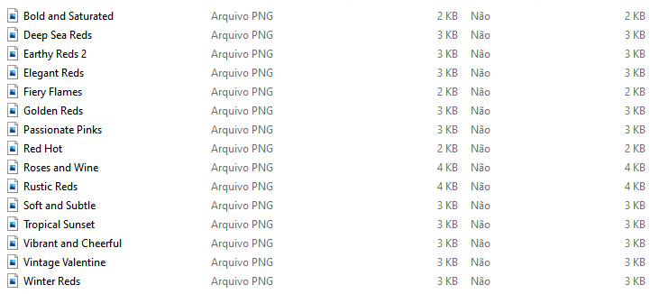
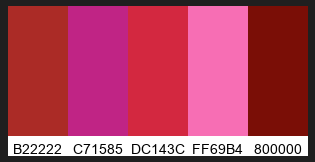

# Color Palette Generator

The Color Palette Generator is a Python script that generates images of color palettes from lists of hexadecimal color codes. The images are saved in PNG format and can be used for design or art projects.

## Dependencies
The Color Palette Generator requires the following dependencies:

* Python 3.10 or later
* Pillow (Python Imaging Library)
* json (Python JSON module)
* zipfile (Python ZIP module)

You can install the Pillow library using pip:

```shell
pip install pillow
```

## Usage

1. Create a JSON file containing color palettes in the following format:
```json
{
  "palette1": ["#FF0000", "#00FF00", "#0000FF"],
  "palette2": ["#FFC0CB", "#FF69B4", "#BA55D3"],
  "palette3": ["#FFFF00", "#FFA500", "#FF4500"]
}
```

2. Run the color_palette.py script:

```shell
python color_palette.py
```

3. The script will generate PNG images of the color palettes and save them in a ZIP file called color_palette.zip.

## Results

The Color Palette Generator produces images of color palettes in PNG format, which are saved in a ZIP file. Each color palette is represented by a horizontal row of color boxes with the hexadecimal codes of the corresponding colors displayed below them. Here is an example of what the output may look like:



You can also visualize each individual color palette separately by extracting the corresponding PNG file from the ZIP file. Here is an example of what the "Roses and Wine" color palette looks like:


